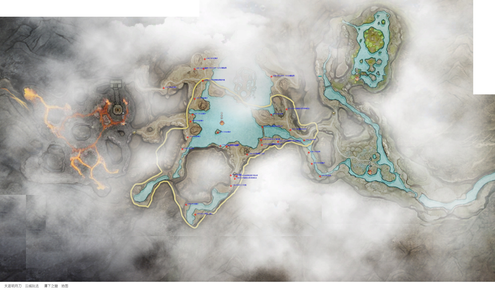
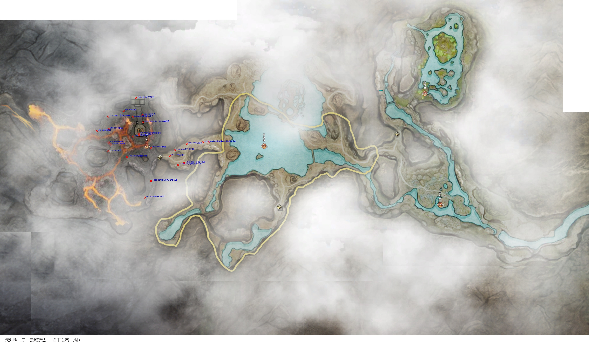
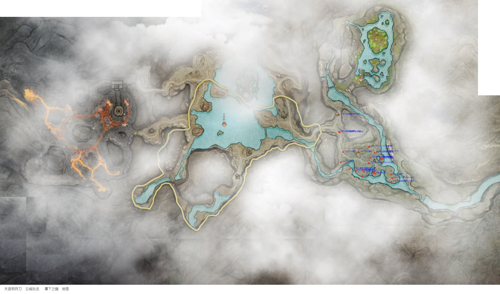

# WuxiaYunchengMap

天涯明月刀 云城探索 点坐标 地图展示工具

可根据提供的坐标在地图上绘制信息

实际使用无需运行代码，查看生成的坐标图片即可。

坐标点信息来自天刀茶话会公众号的攻略

## 控制程序使用

### 安装.NET 桌面运行时

使用[ winget 指令安装](https://learn.microsoft.com/dotnet/core/install/windows?wt.mc_id=DT-MVP-5005195)

此运行时包括基本 .NET 运行时，并支持使用 .NET 生成的 Windows Presentation Foundation (WPF) 和 Windows 窗体应用。 这与 Windows 附带的 .NET Framework 不同。

在控制台中运行以下命令：

```bash
winget install Microsoft.DotNet.DesktopRuntime.7
```

### 运行程序

```bash
WuxiaYunchengMap.exe -p points1.csv -s output_map.png -x 2000 -y 2000 -l map.png  
```

该命令将根据 points1.csv 中的坐标点文件，对 map.png 中的原始地图进行处理，并将处理后的地图保存为 output_map.png 。同时，地图的 X 轴和 Y 轴坐标点将分别给于 2000 和 2000 的修正值。

> 注意： csv 文件的编码必须为 UTF-8 格式，否则会出现乱码

### 命令行参数说明

| 参数 | 说明 |
| --- | --- |
| -p | 坐标点文件路径 |
| -s | 保存的地图文件路径 |
| -x | X 轴坐标修正值 |
| -y | Y 轴坐标修正值 |
| -l | 原始地图文件路径 |


## 第二期	

相关文件：

- map.png （地图修正值：X: 2000, Y: 2000）
- points1.csv
- points2.csv
- points3.csv


## 第三期

相关文件：

- points4.csv
- points5.csv
- points6.csv
- points7.csv








## 后续更新

后续大家可以自己截图拼接地图，将坐标点攻略保存csv文件，然后使用本工具生成地图。